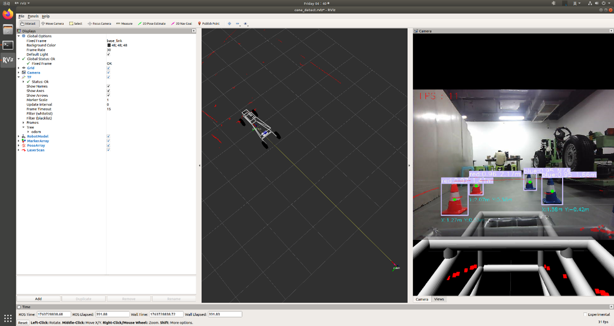
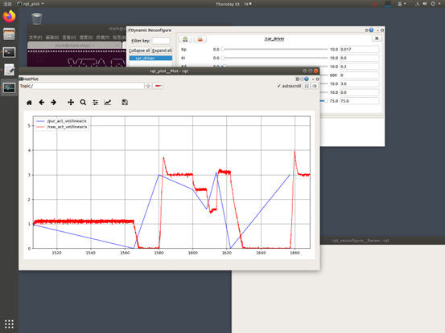
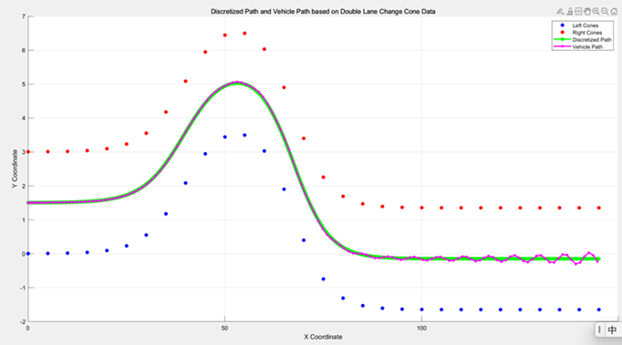
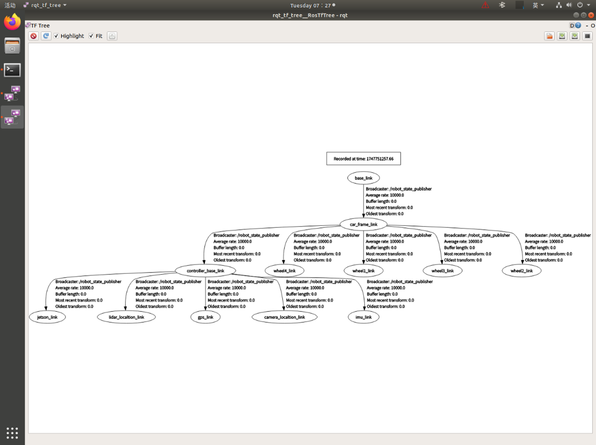

# 基于方程式赛车的自动驾驶系统

[](LICENSE)
[]()

## 项目概述

国家级大学生创新创业训练计划项目，旨在设计并实现一套用于大学生无人驾驶方程式赛车的自动驾驶系统，包含感知层（视觉+激光雷达+IMU+GPS）、决策层（路径跟踪与速度控制）与执行层（线控转向/驱动/制动），目标为完成高速循迹任务。

## 硬件架构

- **上位机**：NVIDIA Jetson Nano B01
- **下位机**：STM32F407zgt6
- **传感器**：奥比中光Gemini深度摄像头、M10激光雷达、IMU948十轴惯导、ATK-S1216F8-BD GPS/北斗模块、霍尔接近开关
- **执行机构**：转向舵机、驱动电机（后驱）、制动电机

## 调试运行画面

### 传感器数据可视化与锥桶识别效果

*基于YOLOv5+TensorRT的锥桶实时识别，结合深度信息获取三维坐标*

### 控制算法调试

*PID控制算法调试界面，显示期望速度与实际速度的跟踪效果*


*Pure Pursuit算法路径跟踪效果，绿色为规划路径，粉色为实际行驶轨迹*

### 总结点图

*ros_graph下的总结点图*

### TF树

*ros_tf_tree下的tf结构图*

## 通信协议

上下位机之间采用自定义UART协议，具体格式如下：

| 标识码 | 地址码 | 长度码 | 功能码 | 数据码 | 校验码 | 结束码 |
|--------|--------|--------|--------|--------|--------|--------|
| 1F     | 非0xFF | 功能码+数据码字节数 | 1字节  | 不定长 | 累加和 | 4D     |

## 项目成果

- 实现10km/h下的稳定循迹
- 锥桶识别准确率达95%以上
- 完成多传感器数据融合与定位
- 设计并实现UART自定义通信协议

## 安装使用

### 环境要求
- Ubuntu 20.04 + ROS melodic
- python==3.6

### 快速开始
```bash
git clone https://github.com/happychickencxk/fsae-autonomous.git
cd fsae-autonomous
catkin_make
source devel/setup.bash